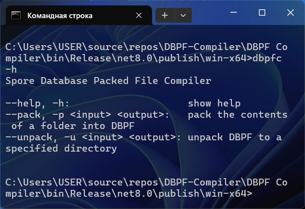
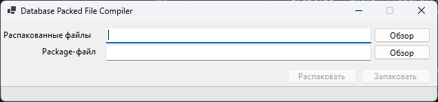

# Spore Database Packed File Compiler

Эта штука может запаковывать различные данные в DBPF (формат файлов, используемый в Spore для упаковки ресурсов).

DBPF Compiler создавался мной для того, чтобы понять принцип хранения данных в Spore. Начиная с версии 1.0.0.5 с помощью него вполне реально создавать небольшие моды, однако, для создания модов я рекомендую [SporeModder FX](https://emd4600.github.io/SporeModder-FX/) (там куда больше возможностей).

## Как использовать

Запустите *dbpfc.exe* через командную строку, используйте флаг `-h`, чтобы получить помощь

Доступные команды:

* `--pack <input> <output>` - запаковать содержимое папки в *.package*-файл, где `<input>` - путь до папки, содержимое которой нужно запаковать, `<output>` - путь до файла, куда надо всё запаковать
* `--unpack <input> <output>` - распаковать *.package*-файл, где `<input>` - путь до *.package*-файла, `<output>` - путь до папки, куда надо распаковать

## Easy Package Packer

Упрощённая версия DPBFC для тех, кому не нравится ковыряться в командной строке

## Требования

Для работы DBPF Compiler'а требуется [.NET 8.0](https://aka.ms/dotnet-core-applaunch?framework=Microsoft.NETCore.App&framework_version=8.0.0)
